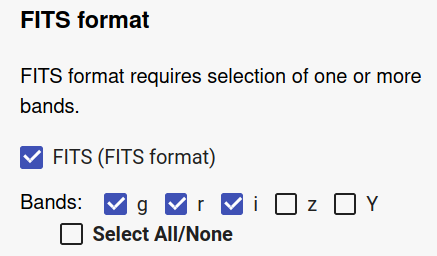
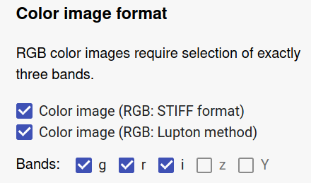
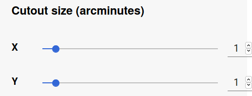
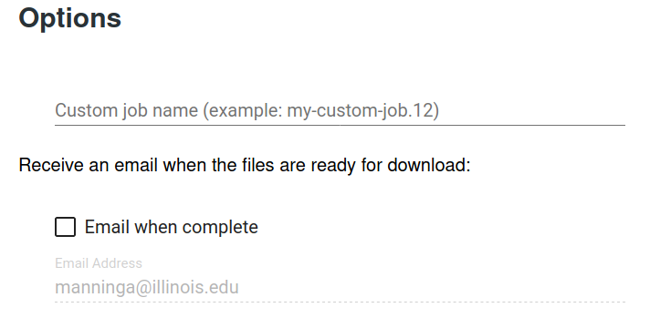

Cutout Service
--------------------------------------

The Cutout Service allows you to download raw or color image data based
on input coordinates and areal dimensions.

.. note::
   See the :ref:`cutout-service-api-details` for complete details about how to specify options.

Select the data release tag associated with the data set you wish
to access. In the text box, enter the positions in the sky that
designate the centers of your cutout images in the form of a
CSV-formatted table, with a header row naming the table columns
for subsequent lines. Each position must be specified using either
RA/DEC sky coordinates or Coadd tile ID. Columns can be in any
order. Omitted values will be set to the default parameter values
you specify using the other form elements as described below.

This example shows all possible columns you can include:::

   RA,DEC,COADD_OBJECT_ID,XSIZE,YSIZE,COLORS_FITS,RGB_STIFF_COLORS,RGB_LUPTON_COLORS,RGB_MINIMUM,RGB_STRETCH,RGB_ASINH,MAKE_FITS,MAKE_RGB_STIFF,MAKE_RGB_LUPTON
   46.275669,-34.256000,,0.90,1.30,g,gry;riy,,,,,true,false,true
   ,,61407409,1.1,0.8,z,,riy,0.9,40.0,11.0,true,,true

This example shows the minimum columns you must include when
specifying positions only by coordinates::

   RA,DEC
   46.275669,-34.256000

or only by Coadd ID::

   COADD_OBJECT_ID
   61407409
   61407435

Select the FITS format to generate raw data files. You will
generate one FITS file for each color band selected (if
available).

Select one or both of the color image formats to generate files
suitable for visual inspection. Two color rendering methods are
offered: **STIFF** and **Lupton**.

Exactly three color bands must be selected. To change the default
selection, first deselect some bands to enable selection of the
ones you want.

The areal dimensions of the requested cutout images are specified
in units of arcminutes.

You may optionally include **XSIZE** and **YSIZE** columns in the
positions CSV-formatted text if you wish to request different
areal dimensions for each requested cutout.

Specifying a custom job name can help make it easier to filter the
job list on the **Job Status** page to find one or more jobs.

To be notified when your job is complete, select the **Email when
Complete** option and ensure that the email address is correct.

When a cutout job is complete, there are three files generated:
``cutout_[JOB_ID].log``, ``positions_[JOB_ID].csv``, and
``summary.json``. The first two files contain the log output and a
CSV-formatted table of the processed positions table, which is
synthesized from the hierarchical compilation of the input
CSV-formatted positions table, then the default parameter values
specified by the user, and then the system defaults. The
``summary.json`` file contains the complete set of information
about the job results in a format amenable to both programmatic
parsing and human readability. The following is an example of this
file:

::

   {
      "options": {
         "colors_fits": "y",
         "db": "DESDR",
         "jobid": "27ddedf1ba3646a8b552cb0718290331",
         "make_fits": true,
         "make_rgb_lupton": true,
         "make_rgb_stiff": true,
         "release": "DR1",
         "rgb_lupton_colors": "izy",
         "rgb_stiff_colors": "riz",
         "username": "jtest",
         "xsize": 1.5,
         "ysize": 0.5,
         "tiledir": "auto"
      },
      "cutouts": [
         {
         "RA": 21.58813,
         "DEC": 3.48611,
         "COADD_OBJECT_ID": null,
         "XSIZE": 1.5,
         "YSIZE": 0.5,
         "FITS_COLORS": "g",
         "RGB_STIFF_COLORS": "gry;riy",
         "RGB_LUPTON_COLORS": "gry",
         "RGB_MINIMUM": 1.0,
         "RGB_STRETCH": 50.0,
         "RGB_ASINH": 10.0,
         "MAKE_FITS": 1.0,
         "MAKE_RGB_STIFF": 1.0,
         "MAKE_RGB_LUPTON": 1.0,
         "COLORS_FITS": "y",
         "POSITION_TYPE": "coord",
         "RA_ADJUSTED": 21.58813,
         "FILES": [
            "DESJ012621.1512+032909.9960_y.fits",
            "DESJ012621.1512+032909.9960_g.fits",
            "DESJ012621.1512+032909.9960_r.fits",
            "DESJ012621.1512+032909.9960_i.fits",
            "DESJ012621.1512+032909.9960_gry_stiff.png",
            "DESJ012621.1512+032909.9960_riy_stiff.png",
            "DESJ012621.1512+032909.9960_gry_lupton.png"
         ],
         "TILEDIR": "/des003/desarchive/multiepoch/Y3A1/r2624/DES0126+0335/p01/coadd/",
         "TILENAME": "DES0126+0335",
         "SEXAGECIMAL": "DESJ012621.1512+032909.9960",
         "ALPHAWIN_J2000": 21.58813,
         "DELTAWIN_J2000": 3.48611
         },
         {
         "RA": 21.57213,
         "DEC": 3.78611,
         "COADD_OBJECT_ID": null,
         "XSIZE": 0.9,
         "YSIZE": 1.3,
         "FITS_COLORS": "rg",
         "RGB_STIFF_COLORS": "gry;riy",
         "RGB_LUPTON_COLORS": "gry",
         "RGB_MINIMUM": 1.0,
         "RGB_STRETCH": 50.0,
         "RGB_ASINH": 10.0,
         "MAKE_FITS": 1.0,
         "MAKE_RGB_STIFF": 1.0,
         "MAKE_RGB_LUPTON": 0.0,
         "COLORS_FITS": "y",
         "POSITION_TYPE": "coord",
         "RA_ADJUSTED": 21.57213,
         "FILES": [
            "DESJ012617.3112+034709.9960_y.fits",
            "DESJ012617.3112+034709.9960_g.fits",
            "DESJ012617.3112+034709.9960_r.fits",
            "DESJ012617.3112+034709.9960_i.fits",
            "DESJ012617.3112+034709.9960_gry_stiff.png",
            "DESJ012617.3112+034709.9960_riy_stiff.png"
         ],
         "TILEDIR": "/des003/desarchive/multiepoch/Y3A1/r2624/DES0126+0335/p01/coadd/",
         "TILENAME": "DES0126+0335",
         "SEXAGECIMAL": "DESJ012617.3112+034709.9960",
         "ALPHAWIN_J2000": 21.57213,
         "DELTAWIN_J2000": 3.78611
         },
         {
         "RA": 46.29566,
         "DEC": -34.256,
         "COADD_OBJECT_ID": null,
         "XSIZE": 0.9,
         "YSIZE": 1.3,
         "FITS_COLORS": "iz",
         "RGB_STIFF_COLORS": "gry;riy",
         "RGB_LUPTON_COLORS": "gry",
         "RGB_MINIMUM": 1.1,
         "RGB_STRETCH": 60.0003,
         "RGB_ASINH": 11.12,
         "MAKE_FITS": 1.0,
         "MAKE_RGB_STIFF": 0.0,
         "MAKE_RGB_LUPTON": 0.0,
         "COLORS_FITS": "y",
         "POSITION_TYPE": "coord",
         "RA_ADJUSTED": 46.29566,
         "FILES": [
            "DESJ030510.9584-341521.6000_y.fits"
         ],
         "TILEDIR": "/des003/desarchive/multiepoch/Y3A1/r2674/DES0305-3415/p01/coadd/",
         "TILENAME": "DES0305-3415",
         "SEXAGECIMAL": "DESJ030510.9584-341521.6000",
         "ALPHAWIN_J2000": 46.29566,
         "DELTAWIN_J2000": -34.256
         }
      ],
      "query_time": "0.32",
      "unmatched_positions": {
         "coord": {
         "RA": [],
         "DEC": []
         },
         "coadd": []
      },
      "processing_time": "48.07",
      "size_on_disk": "6.08 MB",
      "number_of_files": 14
   }
