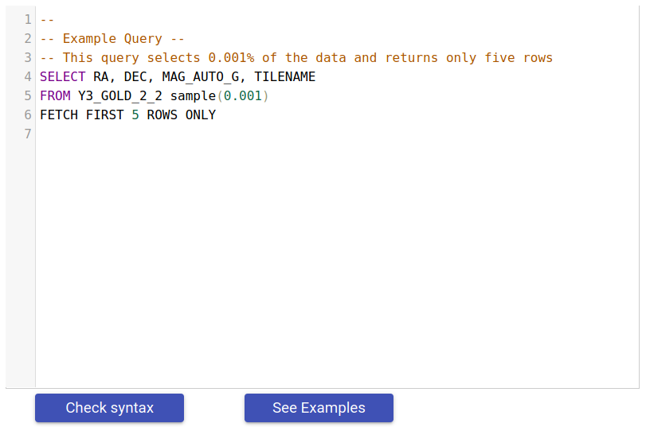
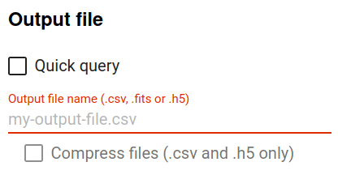
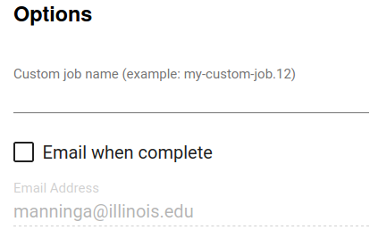

Database Query
--------------------------------------

The database access page allows you to submit your own OracleDB queries
directly to the database.

Use the query editor to compose your database query. The **See
examples** button provides some example queries to explore and
copy into the editor. Before submitting a job, you may use the
**Check syntax** to validate your query syntax to avoid failed
jobs due to typos.

To see results as quickly as possible, you can select **Quick
query**. Query results are truncated at 1000 rows, and the
processing time is limited to 30 seconds. Results are displayed at
the bottom of the page.

For larger queries, you must specify an output file name,
indicating the desired file format. Options include **CSV**,
**H5**, and **FITS**. You may optionally choose to compress the
**CSV** and **H5** files.

Specifying a custom job name can help make it easier to filter the
job list on the **Job Status** page to find one or more jobs.

To be notified when your job is complete, select the **Email when
Complete** option and ensure that the email address is correct.

