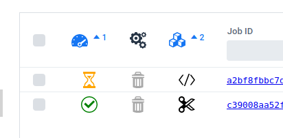
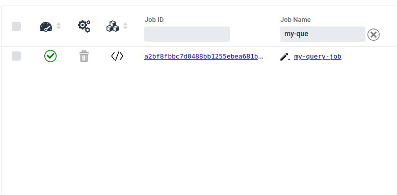
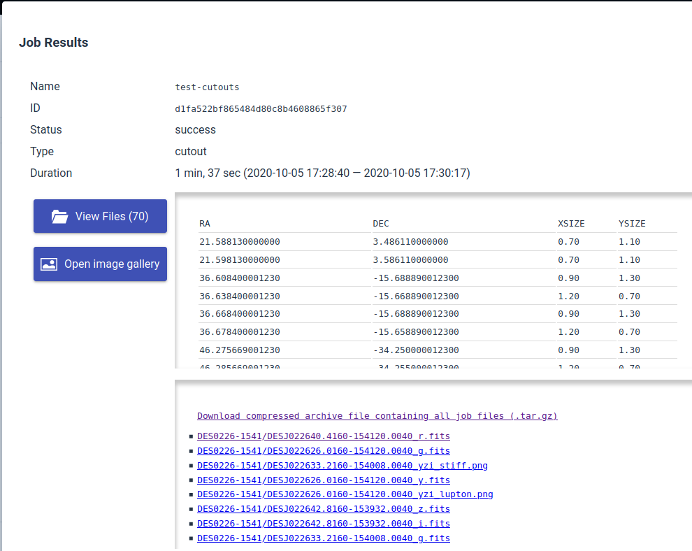
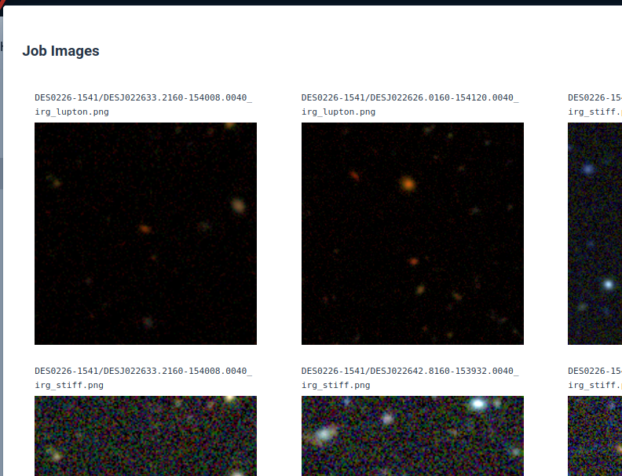

Job Status
--------------------------------------

The **Job Status** column, labeled by the icon, indicates if a job
is in progress , is complete , or has failed .

The **Job Type** column, labeled by the icon, indicates the type
of the job. For most people this is either a database query or a
cutout type.

Jobs may be sorted on multiple columns. For example, you may want
to list jobs in progress at the top of the list, where they are
then sorted by job type. Alternatively, you may want to see all of
you database query jobs first, sorted by status so you can see all
the query jobs still in progress at the top.

**Filter the job list** by typing part of the desired job name or
ID into the column header text fields. Job **IDs** are unique, but
the same job **name** can be applied to multiple jobs, providing a
way to filter your job list to show a group of related jobs.

Job details and results are accessed by clicking the name or ID in
the list. The dialog contains a button to open a listing of the
generated output files for download (see below for details about
programmatic access to job output files). If the job is a
**cutout** job, and there color image files were generated using
the Lupton or STIFF methods, an image gallery is provided for easy
image browsing. If the job is a **database query** job, the job
query text is displayed with a button to conveniently copy the
query back into the editor on the DB Access page.

